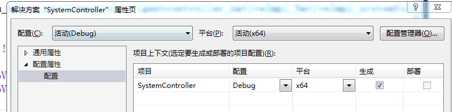

# 使用说明

## 一、dll准备
 ### 1.将 ```C++/SystemController```导入VS2013
 ### 2.根据不同情况设置解决方案的平台属性，我的系统为64位的系统，故设置为```(活动)x64```


 ### 3.F6或者单击```生成解决方案```菜单
 ### 4.将项目目录下的```Debug/SystemController.dll```文件拷贝到```C://windows/system32```目录下

## 二、server准备
### 1.在```java/intelligentcontroller```目录下打开命令行窗口，使用```mvn clean package```命令打包
### 2.双击```java/intelligentcontroller/intelligentcontroller-server/start.sh```命令启动服务

## 三、apk准备

### 1.```Andriod/IntelligenceRemoteController```项目导入andriod studio
### 2.单击```build->build apk```菜单，得到一个apk安装包
### 3.安装该安装包

## 四、注意事项
### 1.server ip地址固定为192.168.0.10，端口号固定为1080，如果需要更改，请修改android源代码
### 2.音乐控制模块中server快捷键针对网易云音乐，有需要修改快捷键的请修改server源代码

## 五、后续内容
### 1.android增加ip动态设置功能
### 2.andriod增加设置滑动页
### 3.快捷键动态指定
